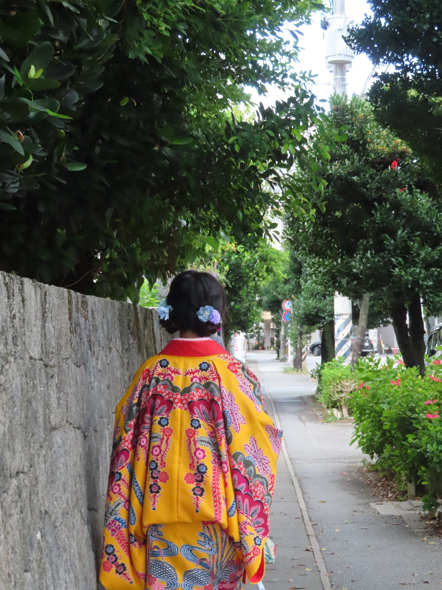
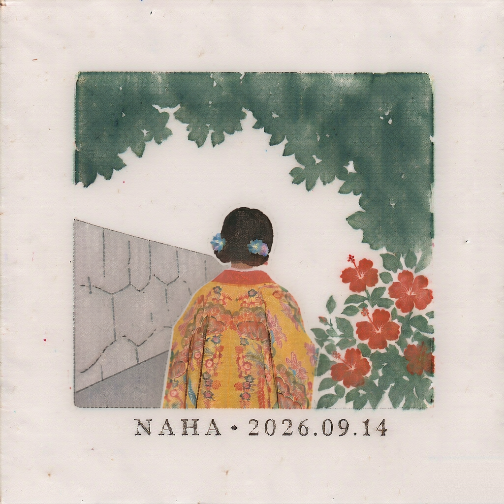
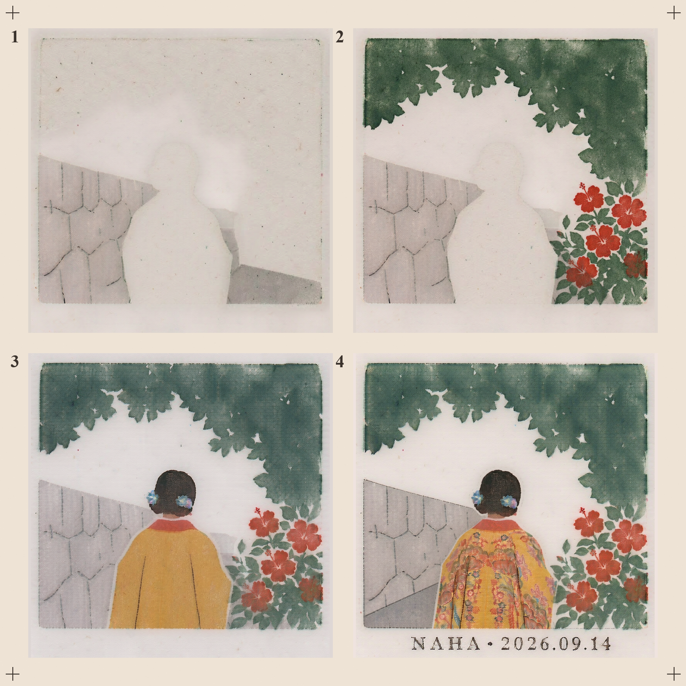
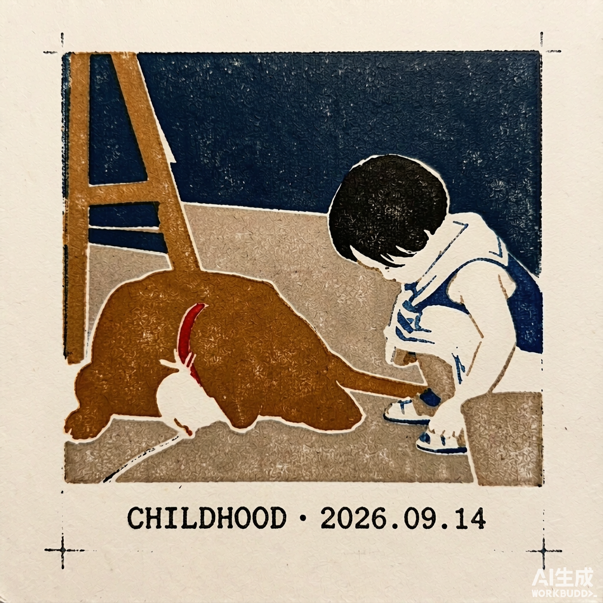
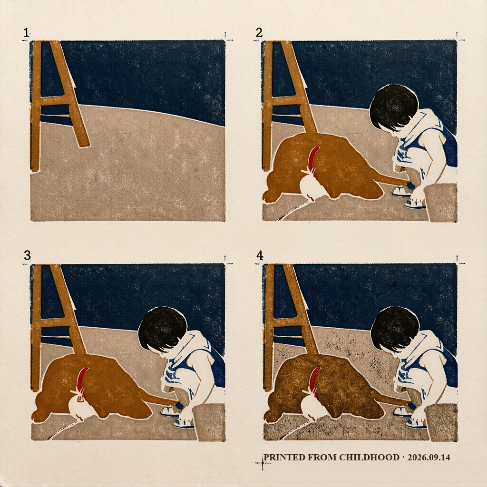
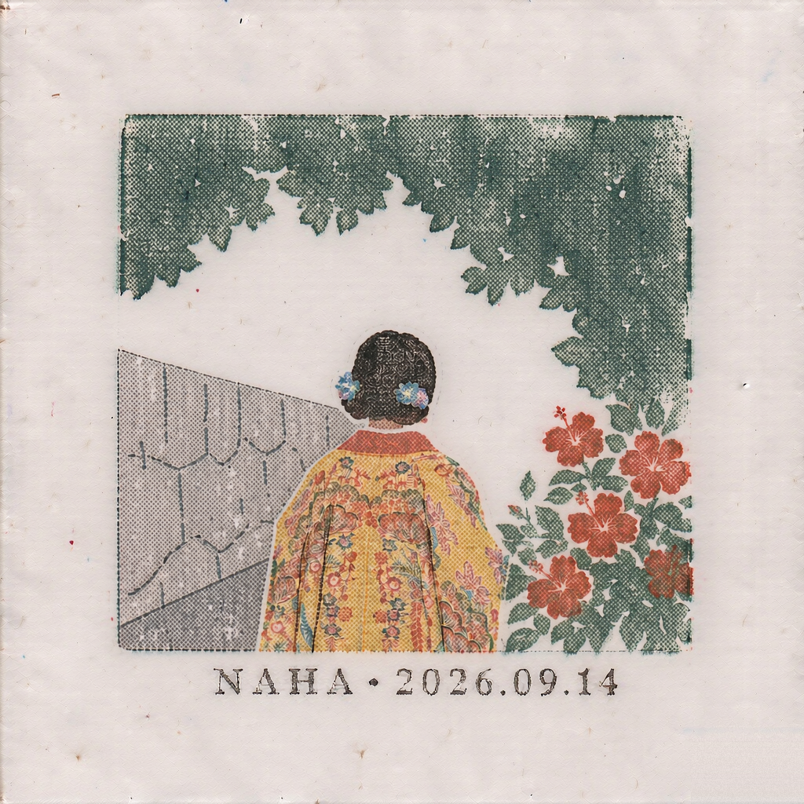
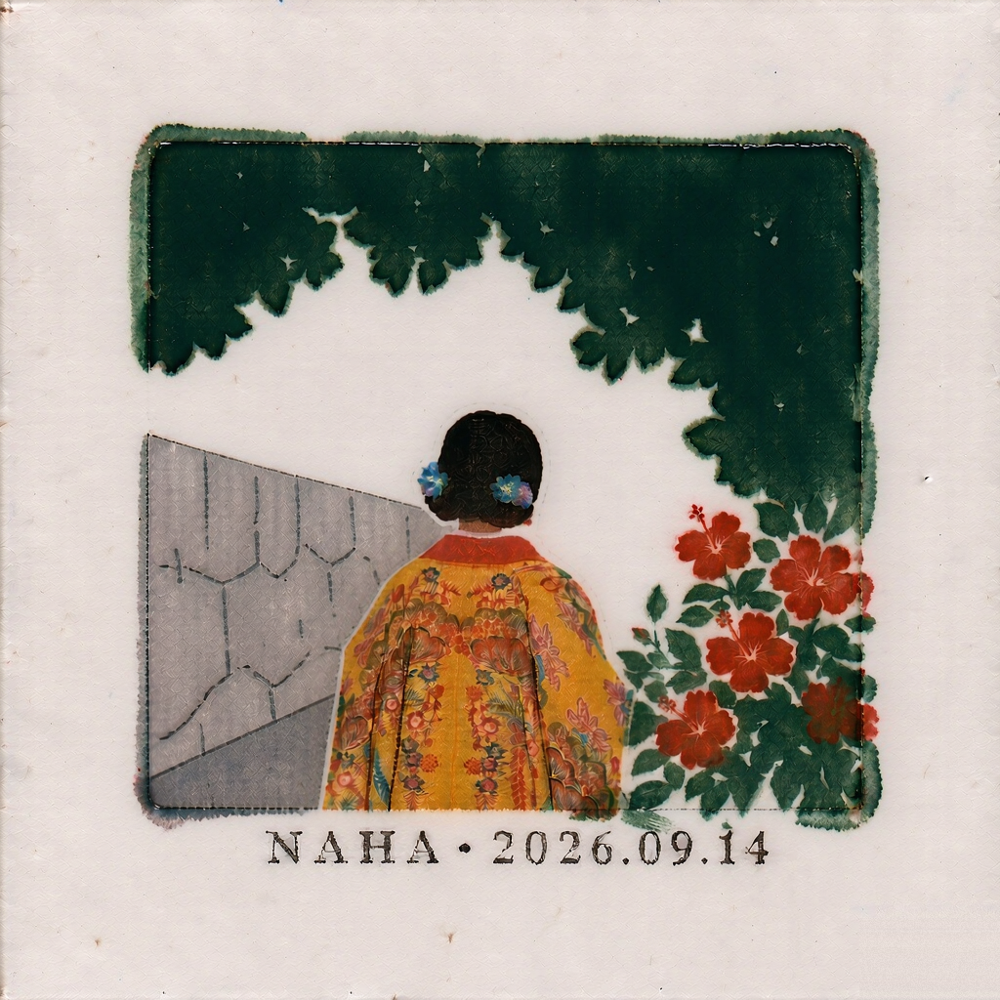

# Museum Stamp Print · 套色印章 Skill

把一张照片变成博物馆文创风格的多层套色印章——可以只出成品，也可以出一张真实套版印刷逻辑的分版步骤图。

Turn a photo into a museum-style multi-layer registration stamp — as a finished stamp alone, or as a step-by-step proof sheet that follows real block-printing logic.

| 原片 Source | 成图 Finished | 步骤图 Steps |
|---|---|---|
|  |  |  |
| 2025年夏那霸琉球装束体验 | 本例抽中中性（非固定绑定） | 2×2 分版过程 |

### 示例 2 · 童年记忆照 Sample 2 · childhood memory

| 成图 Finished | 步骤图 Steps |
|---|---|
|  |  |
| 童年与外公的大黄狗（抽中油性 + 方形） | 环境 → 双主体 → 红项圈 → 同色加深 + 文字 |

原片为作者童年私人照片，未随仓库收录；成图底部邮戳用被动印刷语 `PRINTED FROM CHILDHOOD · 2026.09.14`。此例为双主体场景验证：两个前景主体合并在同一印次上墨，末格以「同色油墨再加深一遍」收官（直接要求补勾线会触发模型的去色重绘），文字经 Pillow 代码层修正。

The source is a private childhood photo and is not included in the repo; the postmark uses passive printmaking wording `PRINTED FROM CHILDHOOD · 2026.09.14`. This example verifies the two-subject pipeline: both foreground subjects share one inking, and the final cell closes with a deepening pass of the SAME inks (asking for added keylines instead triggers the model to drain the colors); the text was corrected at the code layer with Pillow.

## 三种风格 Three styles

| 中性 Neutral | 干性 Dry | 油性 Oily |
|---|---|---|
|  |  |  |
| **默认**。半透明橡皮章墨、硬边、轻微叠印、颗粒纹理。Translucent rubber-stamp ink, hard edges, light overprint, grain. | **更干**。网点/丝网网格、明显缺墨、干辊留白、边缘枯涩。Halftone dots + screen mesh, ink-starved streaks, broken edges. | **更油**。博物馆打卡印章那种刚上足墨、压得实的浓墨覆盖，带 1-2 处未干抹开的湿墨拖痕；不是油画、没有水彩晕边。Freshly-inked check-in stamp: dense rich coverage, crisp flat stamp edges, 1-2 wet smudge streaks; not an oil painting, no watercolor halo. |

## 可用机制 What you can specify

三个维度都可以显式指定，不指定则按默认规则随机：

- **输出形态**：`finished stamp`（只出一枚成品）或 `step by step proof sheet`（分版步骤图，**默认**）。
- **风格**：`干性 / 中性 / 油性`。**对两种输出形态都生效——单独一张成品并不默认中性**，不指定时同样按 **2 : 6 : 2** 抽签。
- **方向**：`正方形 / 竖长方形 / 横长方形`。不指定时 70% 方形、30% 非方形（竖图出竖版、横图出横版）。

Three dials, each overridable; anything left unspecified falls back to a random roll:

- **Output**: `finished stamp` (one finished print) or `step by step proof sheet` (**default**).
- **Style**: `Dry / Neutral / Oily`. **Applies to BOTH output modes — a single finished stamp is NOT bound to Neutral**; unspecified → drawn at **2 : 6 : 2** all the same.
- **Orientation**: `square / portrait / landscape`. Unspecified → 70% square, 30% non-square following the photo.

三者可自由组合，例如：「横版，油性，只要成品」「干性步骤图」「竖版中性」。

Combine freely: "landscape, oily, finished stamp only" · "dry proof sheet" · "portrait neutral".

### 示例所用模式组合 Example mode combos

| 示例 Example | 模式组合 Mode combo |
|---|---|
| 上方三联图 triptych above | proof sheet · 中性 Neutral · 方形 square |
| 示例 2 双联图 sample 2 · dog | proof sheet · 油性 Oily · 方形 square |
| 风格表·干性 style table · Dry | finished stamp · 干性 Dry · 方形 square |
| 风格表·油性 style table · Oily | finished stamp · 油性 Oily · 方形 square |

## 安装 Install

支持任何使用 `SKILL.md` 风格 skill 且带 image-to-image 生图工具的 Agent 环境（WorkBuddy/CodeBuddy 里是 `ImageGen` 的 `image1`/`image2`，其他环境按本地参数名适配）。

Works in any `SKILL.md`-style agent environment with an image-to-image tool (in WorkBuddy/CodeBuddy that's `ImageGen` with `image1`/`image2`; adapt parameter names elsewhere).

```bash
git clone https://github.com/Guzi2005/layered-stamp-skill.git

# WorkBuddy / CodeBuddy
cp -r layered-stamp-skill ~/.workbuddy/skills/museum-stamp-print

# Claude Code
cp -r layered-stamp-skill ~/.claude/skills/museum-stamp-print
```

只需要 Python 3 + Pillow 做最后的拼版（`pip install Pillow`），其余全靠生图模型完成。

Only Python 3 + Pillow is needed for the final layout step (`pip install Pillow`); everything else is done by the image model.

## 工作原理 How it works

整图一次生成 4 格容易违反步骤逻辑（人物提前出现、同一版颜色互混、成品被复制到每格），所以用链式确定性流程：先用原片生成母版成品，再从母版逐格回推出分版步骤（每格 = 前一格 + 恰好一个新色版），最后用 Pillow 裁切归一、去水印、画序号和套准十字——只有排版是代码，印刷本身全是生图。

Generating all four cells in one shot kept breaking step logic (subjects appearing early, same-pull colors mixing, the finished print copied into every cell), so the verified route is a deterministic chain: master first from the source photo, then cells derived one by one (each cell = previous cell + exactly one new block), finally composed with Pillow — only layout is code, the printing itself is all generation.

步骤逻辑严格遵守真实套色印章：半透明叠印（跨版压色变深）、挖空留白（前景版盖进预留空白）、一版一步（版内颜色只并置不混）、收官跳变（最后一格同时上纹样细节 + 轮廓线 + 文字）。人物规则：背影无脸，正面只给极简概括五官。成品底部文字优先用被动式印刷语，如 `PRINTED IN NAHA · 2026.09.14`，无地名的记忆照可用 `STAMPED IN MEMORY · 2026.09.14`。

Step logic follows real registration stamps: translucent overprint across blocks (overlaps darken), knockout voids reserved for foreground blocks, one block per step (colors within a pull butt, never mix), and a big final jump (pattern details + keyline + text together). Figures: no face from behind; minimal generalized features from the front. The bottom text prefers passive-voice printmaking wording, e.g. `PRINTED IN NAHA · 2026.09.14`, or `STAMPED IN MEMORY · 2026.09.14` for place-less memory photos.

## 已知不足 Known limitations

诚实地列出当前缺陷，欢迎在此基础上二次开发：

- **材质残余**：偶发纸胶带、水彩材质的痕迹混入；
- **前后一致性不稳定**：步骤格与成品之间的人物/景物细节可能漂移；
- **步骤间跨度不稳定**：相邻两步的变化量忽大忽小，偶尔两格几乎相同；
- **可能的步骤颠倒错位**：极少数情况下色版顺序与预期不符（如细节版早于底色版出现）。

Honest list of current flaws — forks and pull requests welcome:

- **Material residue**: occasional paper-tape or watercolor texture sneaking in;
- **Unstable consistency**: details between step cells and the finished print may drift;
- **Unstable step spans**: the jump between adjacent steps varies, sometimes two cells look nearly identical;
- **Possible step inversion**: in rare cases a color block appears in the wrong order (e.g. details before the base block).

修复方向提示：材质残余可加强 NOT 列表权重；一致性可尝试把成品作为 `image2` 参考逐格校正；跨度问题可在 prompt 中显式声明每步新增元素的体量。

Hints for contributors: strengthen the NOT-list against material residue; feed the finished print as `image2` to correct per-cell drift; declare the expected volume of each step's addition explicitly in the prompt.

## 作者 Author

**Guzi2005** — 最好是能帮到你

与 **WorkBuddy AI**（CodeBuddy 智能体）协作开发：全部提示词工程、流程验证与迭代由 AI 完成，方向判断与审美定稿由人类作者把关。

Co-developed with **WorkBuddy AI** (the CodeBuddy agent): prompt engineering, pipeline verification and iteration by the AI; direction calls and final aesthetic judgment by the human author.

## 致谢 Acknowledgements

本 skill 的诞生站在两个前作的肩膀上，部分风格规则（画面边缘处理、照片→手账感转换）受其启发，推荐一并食用：

- **[make-tape-collage](https://github.com/sherlyryn/make-tape-collage)** — 纸胶带拼贴 skill；
- **[travel-memory-sticker-card](https://github.com/carolinaaafy/travel-memory-sticker-card)** — 旅行手账贴纸卡 skill。

This skill stands on the shoulders of two prior works — some style rules (edge treatment, photo-to-journal feel) were inspired by them:

- **[make-tape-collage](https://github.com/sherlyryn/make-tape-collage)** — paper-tape collage skill;
- **[travel-memory-sticker-card](https://github.com/carolinaaafy/travel-memory-sticker-card)** — travel journal sticker-card skill.

## 许可证 License

[MIT](LICENSE) · 示例图片均来自作者本人的照片。
